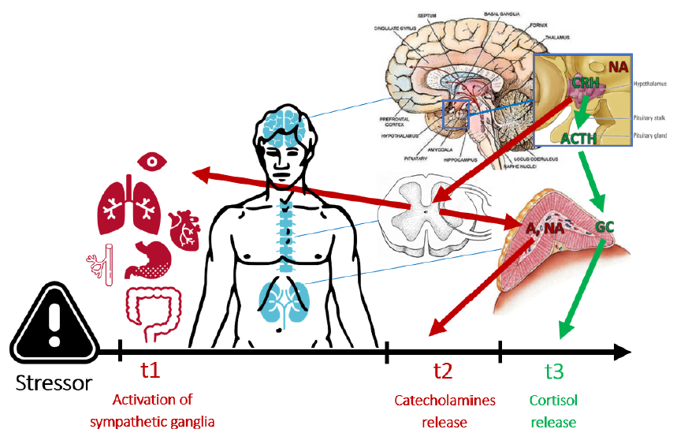
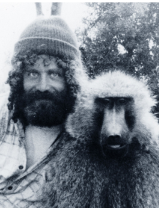
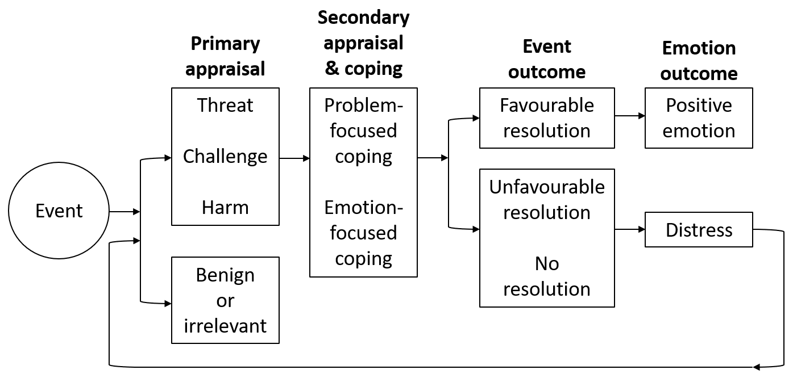
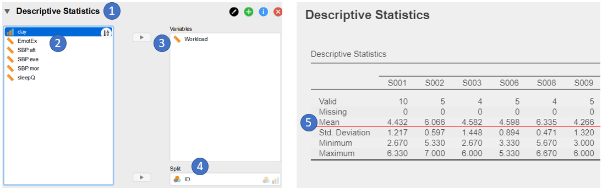

```{r setup, include=FALSE}

knitr::opts_chunk$set(echo = TRUE,tidy.opts = list(width.cutoff=80))
knitr::opts_chunk$set(
  collapse = TRUE,
  comment = NA
)
library(Cairo)

```

## My path

\fontsize{6.5pt}{12}\selectfont

-   **2014: BSc in Social and Work Psychology** @ uniPD \newline \fontsize{5.5pt}{12}\selectfont "*Biofeedback training for managing workplace stress in organizational contexts*" \fontsize{6.5pt}{12}\selectfont

-   **2016: MSc in Social, Work, & Communication Psychology** @ uniPD \newline \fontsize{5.5pt}{12}\selectfont "*A psychophysiological assessment protocol for workplace stress risk assessment*" \fontsize{6.5pt}{12}\selectfont

-   **2017: Post-lauream internship** @ Inside Performance (stress management & biofeedback in sport and organizational contexts) + **Psychophysiology Lab** @ uniPD (signal processing & data analysis) 

-   **2017-2021: Ph.D. in Psychological Sciences** @uniPD \newline \fontsize{5.5pt}{12}\selectfont "*Towards the psychophysiological assessment of stressors and strain under ecological conditions*" \fontsize{6.5pt}{12}\selectfont

-   **2020: Visiting period** @ SRI International (CA, USA) \newline \fontsize{5.5pt}{12}\selectfont Use & accuracy of sleep consumer technology, relationships between stress and sleep \fontsize{6.5pt}{12}\selectfont

-   **2021: Postdoc fellow** @ uniBO \newline \fontsize{5.5pt}{12}\selectfont "*State workaholism & daily fluctuations in blood pressure, emotional exhaustion, and sleep quality*" \fontsize{6.5pt}{12}\selectfont

-   **2023: Postdoc fellow** @ uniTN \newline \fontsize{5.5pt}{12}\selectfont "*Youth transitions from school to work*"

## Outline

```{r , echo = FALSE, fig.align="center"}
# knitr::include_graphics("images/ggplot2.PNG")
```

\fontsize{8pt}{12}\selectfont
- **The stress response** \newline Origins, definitions and classical models of stress

- **Psychoneuroendocrinoimmunology (PNEI)** \newline Psychobiological processes involved in the stress response

- **Allostatic Load Theory** \newline The consequences of stress on health and illness

- **Psychological theories of stress** \newline Cognitive, affective, and social processes incolved in the stress response

- **Psychophysiology of workplace stress** \newline Psychosocial hazards & psychophysiological responses \newline

- **Hands on: Towards multilevel modeling** \newline Modeling workplace stress within individuals

# Stress response

## What is stress?

## What is stress?

\fontsize{8pt}{12}\selectfont
- Complex & **multifaceted** phenomenon: multiple dimensions placed on **different epistemological levels**

- Investigated by **different disciplines** (e.g., physics, biology, medicine, psy) 

- In turn, influenced by factors of various nature (e.g., biochemical, genetic, psychosocial) with **transitory** (e.g., exam), **chronic** (e.g., war), and even **dispositional** time course (e.g., anxiety disorder)

- Associated with individual **health & well-being**

## Historical origins of stress research

\begincols
  \begincol{.15\textwidth}
  
```{r , echo = FALSE, out.width = "60px"}

```
  
  \endcol
\begincol{.85\textwidth}

\fontsize{7pt}{12}\selectfont

- "**stress**" originates from the Latin term "*strictus*" (narrow), initially used to describe an elastic body's response (pressure changes called "*strain*", i.e., tension) to an external force \newline

- **Claude Bernard (1865)**: father of experimental medicine, notion of homeostasis; started using "*estresse*" to call the body’s defence reactions to strong external stimulations \newline

- **Walter Cannon (1915)**: identified a global response through which the *Autonomic Nervous System* (ANS) reacts to threatening stimuli in order to maintain homeostasis: The **alarm reaction** \newline

>- **Hans Selye (1936)**: identified a *nonspecific* and *gradual* response to different nocuous agents (e.g., cold temperature, surgical injuries, excessive physical exercise, toxic substances): \newline The **General Adaptation Syndrome**

  \endcol
\endcols

## Classical stress theories: The alarm reaction

\fontsize{7pt}{12}\selectfont
**Alarm reaction**: global *sympatho-motor activation* to threatening stimuli: \newline ++ heart rate, blood pressure, & respiratory frequency, visceral vasoconstriction, muscular vasodilation, inhibition of gastric functions, etc. \fontsize{5.5pt}{12}\selectfont (Cannon, 1932) \fontsize{7pt}{12}\selectfont

- Involves the **sympathetic-adrenal-medullary (SAM)** system, preparing the body for action (***fight-or-flight response***) to protect itself from intense and dangerous/painful stimulations

- Natural **adaptive defense mechanism** of the body, functional for the survival of the species, and specifically to maintain homeostasis

- ***"Homeostasis"***: term adapted from fluid physics to describe the stability of the normal physiological processes in the body; from the Greek "*homeoios*" (similar) e "*stasis*" (fixed, still)

## Autonomic Nervous System

\fontsize{6pt}{12}\selectfont

- Nervous system = Central (brain + spinal cord) + Peripheral (all other nerves)

- Peripheral = Somatic (voluntary) + **Autonomic (ANS)** ("involuntary") \fontsize{7pt}{12}\selectfont

- **ANS** = \color{blue} **Parasympathetic (*****rest-and-digest*****)** \color{black} + \color{red} **Sympathetic (*****fight-or-flight*****)**

```{r , echo = FALSE, out.width = "220px", fig.align='center'}
knitr::include_graphics("img/ans.PNG")
```

\fontsize{4.5pt}{12}\selectfont
Icons created by Freepik at \color{blue} [flaticon.com](https://www.flaticon.com/free-icons/penis")

## Classical stress theories: GAS

\fontsize{7pt}{12}\selectfont
**General Adaptation Syndrome**: "*the sum of all nonspecific, systemic reactions of the body which ensue upon long-continued exposure to stress*" \fontsize{5.5pt}{12}\selectfont (Selye, 1946) 

\fontsize{7pt}{12}\selectfont 
**Nonspecific response** (i.e., same response to any nocuous agent) in three stages:

1. **Alarm reaction** (from Cannon): short-term adaptive response resulting in increased energy availability and immune defense (*fight-or-flight*)

2. **Resistance**: when the exposure is prolonged, the response can be sustained over time, and the organism increasingly adapts

3. **Exhaustion**: exposures prolonged for several weeks/months may result in severe damage to the body (e.g., gastro-instestinal ulceres) and increased vulnerability to both the original and other stressful stimuli (+% illness & death)

```{r , echo = FALSE, out.width = "220px", fig.align='center'}
knitr::include_graphics("img/gas.PNG")
```

\fontsize{4.5pt}{12}\selectfont
Icons created by Freepik at \color{blue} [flaticon.com](https://www.flaticon.com/free-icons/penis")

## What is stress? Some more specific definitions

\fontsize{7pt}{12}\selectfont
Selye and his successors operationalized the term ‘stress’ in at least three different ways: \newline (1) as a threatening *external stimulus*, (2) as a *nonspecific response* to the stimulus, \newline (3) as the *interaction* between the nocuous agent and the body's defenses

Even **in psychology**, there is no general consenus on terms and definitions, although some categories are widely used:

- ***Stress***: activation (*arousal*) state of the body resulting from the exposure to nonspecific nocuous stimuli, and mediated by the subjective *appraisal* of the stimulus as dangerous or exceeding individual resources

- ***Stressor***: nonspecific internal/external stimulus resulting in the stress response

- ***Strain***: short- and long-term physiological, behavioral, and psychological modifications characterizing the stress response

## Psycho - Neuro - Endocrino - Immunology

\fontsize{8pt}{12}\selectfont
Despite the conceptual ambiguity, the interdisciplinary nature of stress has contributed to the definition of more **holistic approaches** to its investigation. \newline

- **PNEI**: study of the interactions between **behavioral** (e.g., fight-or-flight response), **neural** (e.g., ANS, prefrontal cortex), **endocrine** (e.g., cortisol), and **immune** systems (e.g., proinflammatory cytokines)

- Privileged perspective to understand the components of the stress response

## PNEI of the stress response

\fontsize{8pt}{12}\selectfont 

- \color{red} **Sympathetic-adrenal-medullary (SAM) axis** \newline \color{black} The 'fast pathway' (nervous) \color{green}

- **Hypothalamo–pituitary–adrenocortical (HPA) axis** \newline \color{black} The 'slow pathway' (endocrine)

```{r , echo = FALSE, out.width = "200px", fig.align='center'}

```

\fontsize{4.5pt}{12}\selectfont
Icons created by Freepik at \color{blue} [flaticon.com](https://www.flaticon.com/free-icons/penis")

## SAM: The 'fast (nervous) pathway' 

\fontsize{6pt}{12}\selectfont 

- Sensorial information (perceptual system) processed by the *thalamic nuclei*, transmitted to the *amygdala*, forwarded to the **hypothalamus** and the *locus coeruleus* (**NA** release)

- **Direct response (t1)**: fast (seconds) symphato-motor activation (*fight-or-flight*)

- **Mediated response (t2)**: nervous signals to the **adrenal medullas** &rightarrow; **A** and **NA** release into the blood stream &rightarrow; +glucose availability & vascularization in the muscles, prolonging the response over some minutes

```{r , echo = FALSE, out.width = "170px", fig.align='center'}

```

\fontsize{4.5pt}{12}\selectfont
Icons created by Freepik at \color{blue} [flaticon.com](https://www.flaticon.com/free-icons/penis")

## HPA: The 'slow (endocrine) pathway'

\fontsize{6pt}{12}\selectfont 

- The paraventricular nucleus of the **hypotalamus** releases the CRH hormone, stimulating the **pituitary gland** (hypophysis) to release the ACTH hormone into the blood stream to the **adrenal cortexes**, which release the *glucocordicoids* (**GC**)

- **GC** (e.g. **cortisol** with peaks around 15-20 min) interact with glucose metabolism (+energy) and the CNS: inhibition of CRH relsease (**negative feedback**)

- Immune responses (release of *proinflammatory cytokines*, antibody production)

```{r , echo = FALSE, out.width = "170px", fig.align='center'}

```

\fontsize{4.5pt}{12}\selectfont
Icons created by Freepik at \color{blue} [flaticon.com](https://www.flaticon.com/free-icons/penis")

# Allostatic load

## What is stress?

Is stress a disease? Is it a form of illness?

How does stress impact on health and wellbeing?

## What is stress?

\fontsize{8pt}{12}\selectfont 

- Stress is *not* a pathological state, but rather “*the* [natural] ***wear and tear of the body*** […] *caused by any type of vital reaction in any moment*” \newline \fontsize{5.5pt}{12}\selectfont (Selye, 1956, p. 274) \fontsize{8pt}{12}\selectfont 

- Most of the time, it is an adaptive response (***eustress***), characterized by a motivational nature that is functional to daily life (homesostasis)

- Only under in certain conditions (***distress***), it might lead to the onset of diseases, impairment of the body and, eventually, to death

## Homeostasis & Allostasis

\fontsize{8pt}{12}\selectfont 

- **Homeostasis**: body’s ability to maintain the ‘*set points*’ of its physiological processes (e.g., basal blood pressure) through negative feedback mechanisms (e.g., the baroceptors activity)

- **Allostasis** (*adaptation through change*): the set points are modified and overwritten by neuroendocrine circuits (SAM and HPA axes) in order to better adapt to the environment, and to anticipate environmental demands \newline

In other words, the cumulative changes due to stress responses result in an **updated of the "biological memory"** of the organism, with no way to get back to the previous homeostatic condition. \newline

- **Allostatic load**: ‘biological cost’ of such adaptation, the ‘wear and tear’ of the body \fontsize{5pt}{12}\selectfont  (Sterling e Eyer, 1988)

## Allostatic Load Theory

\begincols
  \begincol{.45\textwidth}
  
```{r , echo = FALSE, warning=FALSE,message=FALSE,fig.width=3,fig.height=1.7,fig.align='center'}
library(ggplot2)
df <- data.frame(time=0:10,stress=c(2,4,5,6,7,6,6,5,4,3,2))
ggplot(df,aes(time,stress)) + geom_line(color="lightblue",lwd=1.2) + geom_point(color="lightblue",cex=3) +
  geom_line(data=data.frame(time=c(0.5,4),stress=c(1.5,1.5)),col="red",lwd=2) +
  geom_line(data=data.frame(time=c(4.5,9),stress=c(1.5,1.5)),col="gray",lwd=2) +
  ylim(1,7.5) + geom_text(data=data.frame(time=c(2,6.5),stress=c(2.5,2.5)),label=c("Stress","Recovery")) +
  ggtitle("Normal response") + ylab("Physiological response") + xlab("Time") +
  theme(axis.text=element_blank())
```
Allostatic Load:
```{r , echo = FALSE, warning=FALSE,message=FALSE,fig.width=5,fig.height=3.4,fig.align='center'}
df <- data.frame(time=seq(1,9.75,0.25),stress=rep(c(seq(2,7,2),rev(seq(3,7,2))),6))
p1 <- ggplot(df,aes(time,stress)) + geom_line(color="lightblue",lwd=1.2) + geom_point(color="lightblue",cex=3) +
  ylim(1,7.5) + ggtitle("Repeated hits") + theme(axis.text=element_blank(),axis.title=element_blank())

df$adapt <- c(df$stress[1:7],df$stress[2:7]*0.9,df$stress[2:7]*0.8,df$stress[2:7]*0.7,df$stress[2:12]*0.6)
p2 <- ggplot(df,aes(time,stress)) + geom_line(color="lightblue",lwd=1.2) + geom_point(color="lightblue",cex=3) +
  ylim(1,7.5) + ggtitle("Lack of adaptation") + theme(axis.text=element_blank(),axis.title=element_blank()) + 
  geom_line(aes(y=adapt),color="red",lwd=1.2) + geom_point(aes(y=adapt),color=rgb(1,0,0,alpha=0.6),cex=3) +
  geom_text(data=data.frame(time=3.5,stress=1.2),label="Normal adaptation", color="red")
  
df <- data.frame(time=0:10,stress=c(2,4,5,6,7,6.9,7,7.1,7,6.9,7))
p3 <- ggplot(df,aes(time,stress)) + geom_line(color="lightblue",lwd=1.2) + geom_point(color="lightblue",cex=3) +
  geom_line(data=data.frame(time=c(0.5,4),stress=c(1.5,1.5)),col="red",lwd=2) +
  geom_line(data=data.frame(time=c(4.5,9),stress=c(1.5,1.5)),col="gray",lwd=2) +
  ylim(1,7.5) + geom_text(data=data.frame(time=c(2,6.5),stress=c(2.5,2.5)),label=c("Stress","Lack of recovery")) +
  ggtitle("Prolonged response") + theme(axis.text=element_blank(),axis.title=element_blank())

df <- data.frame(time=0:10,stress=c(2,2.5,3,3.5,3.5,3.5,3.5,3.4,3.2,3,2.5))
p4 <- ggplot(df,aes(time,stress)) + geom_line(color="lightblue",lwd=1.2) + geom_point(color="lightblue",cex=3) +
  ylim(1,7.5) + ggtitle("Inadequate response") +
  theme(axis.text=element_blank(),axis.title=element_blank())

library(gridExtra)
grid.arrange(p1,p2,p3,p4,nrow=2)
```
  \endcol
\begincol{.55\textwidth}

\fontsize{7pt}{12}\selectfont
The allostatic load involves all PNEI levels, mainly due to four conditions: \newline

1. **Repeated 'hits' / exposure**: when the body is exposed to one or more stressors in a *repeated or prolonged* fashion \fontsize{6pt}{12}\selectfont \newline \newline e.g. **CNS**: chronically high levels of cortisol lead to deterioration of central structures such as the **hyppocampus** (memory, learning, CRH inhibition) &rightarrow; vicious circle with more and more serious damages 

  \endcol
\endcols

\fontsize{5pt}{12}\selectfont Adapted from McEwen, B. S. (1998) \color{blue} **[doi:10.1056/NEJM199801153380307](https://doi.org/10.1056/NEJM199801153380307)** 

## Allostatic Load Theory

\begincols
  \begincol{.45\textwidth}
  
```{r , echo = FALSE, warning=FALSE,message=FALSE,fig.width=3,fig.height=1.7,fig.align='center'}
library(ggplot2)
df <- data.frame(time=0:10,stress=c(2,4,5,6,7,6,6,5,4,3,2))
ggplot(df,aes(time,stress)) + geom_line(color="lightblue",lwd=1.2) + geom_point(color="lightblue",cex=3) +
  geom_line(data=data.frame(time=c(0.5,4),stress=c(1.5,1.5)),col="red",lwd=2) +
  geom_line(data=data.frame(time=c(4.5,9),stress=c(1.5,1.5)),col="gray",lwd=2) +
  ylim(1,7.5) + geom_text(data=data.frame(time=c(2,6.5),stress=c(2.5,2.5)),label=c("Stress","Recovery")) +
  ggtitle("Normal response") + ylab("Physiological response") + xlab("Time") +
  theme(axis.text=element_blank())
```
Allostatic Load:
```{r , echo = FALSE, warning=FALSE,message=FALSE,fig.width=5,fig.height=3.4,fig.align='center'}
df <- data.frame(time=seq(1,9.75,0.25),stress=rep(c(seq(2,7,2),rev(seq(3,7,2))),6))
p1 <- ggplot(df,aes(time,stress)) + geom_line(color="lightblue",lwd=1.2) + geom_point(color="lightblue",cex=3) +
  ylim(1,7.5) + ggtitle("Repeated hits") + theme(axis.text=element_blank(),axis.title=element_blank())

df$adapt <- c(df$stress[1:7],df$stress[2:7]*0.9,df$stress[2:7]*0.8,df$stress[2:7]*0.7,df$stress[2:12]*0.6)
p2 <- ggplot(df,aes(time,stress)) + geom_line(color="lightblue",lwd=1.2) + geom_point(color="lightblue",cex=3) +
  ylim(1,7.5) + ggtitle("Lack of adaptation") + theme(axis.text=element_blank(),axis.title=element_blank()) + 
  geom_line(aes(y=adapt),color="red",lwd=1.2) + geom_point(aes(y=adapt),color=rgb(1,0,0,alpha=0.6),cex=3) +
  geom_text(data=data.frame(time=3.5,stress=1.2),label="Normal adaptation", color="red")
  
df <- data.frame(time=0:10,stress=c(2,4,5,6,7,6.9,7,7.1,7,6.9,7))
p3 <- ggplot(df,aes(time,stress)) + geom_line(color="lightblue",lwd=1.2) + geom_point(color="lightblue",cex=3) +
  geom_line(data=data.frame(time=c(0.5,4),stress=c(1.5,1.5)),col="red",lwd=2) +
  geom_line(data=data.frame(time=c(4.5,9),stress=c(1.5,1.5)),col="gray",lwd=2) +
  ylim(1,7.5) + geom_text(data=data.frame(time=c(2,6.5),stress=c(2.5,2.5)),label=c("Stress","Lack of recovery")) +
  ggtitle("Prolonged response") + theme(axis.text=element_blank(),axis.title=element_blank())

df <- data.frame(time=0:10,stress=c(2,2.5,3,3.5,3.5,3.5,3.5,3.4,3.2,3,2.5))
p4 <- ggplot(df,aes(time,stress)) + geom_line(color="lightblue",lwd=1.2) + geom_point(color="lightblue",cex=3) +
  ylim(1,7.5) + ggtitle("Inadequate response") +
  theme(axis.text=element_blank(),axis.title=element_blank())

library(gridExtra)
grid.arrange(p1,p2,p3,p4,nrow=2)
```

  \endcol
\begincol{.55\textwidth}

\fontsize{7pt}{12}\selectfont
The allostatic load involves all PNEI levels, mainly due to four conditions: \newline

2. **Lack of adaptation**: when the *intensity of the stress response does not decrease*, as it is supposed to do, after numerous exposures to the same stressor \fontsize{6pt}{12}\selectfont \newline \newline e.g. **ANS**: blood pressure allostatically increases each morning to make us waking up, but repeatedly high levels of blood pressure (SNS) can promote the formation of atherosclerotic plaques in the coronary artery

  \endcol
\endcols

\fontsize{5pt}{12}\selectfont Adapted from McEwen, B. S. (1998) \color{blue} **[doi:10.1056/NEJM199801153380307](https://doi.org/10.1056/NEJM199801153380307)** 

## Allostatic Load Theory

\begincols
  \begincol{.45\textwidth}
  
```{r , echo = FALSE, warning=FALSE,message=FALSE,fig.width=3,fig.height=1.7,fig.align='center'}
library(ggplot2)
df <- data.frame(time=0:10,stress=c(2,4,5,6,7,6,6,5,4,3,2))
ggplot(df,aes(time,stress)) + geom_line(color="lightblue",lwd=1.2) + geom_point(color="lightblue",cex=3) +
  geom_line(data=data.frame(time=c(0.5,4),stress=c(1.5,1.5)),col="red",lwd=2) +
  geom_line(data=data.frame(time=c(4.5,9),stress=c(1.5,1.5)),col="gray",lwd=2) +
  ylim(1,7.5) + geom_text(data=data.frame(time=c(2,6.5),stress=c(2.5,2.5)),label=c("Stress","Recovery")) +
  ggtitle("Normal response") + ylab("Physiological response") + xlab("Time") +
  theme(axis.text=element_blank())
```
Allostatic Load:
```{r , echo = FALSE, warning=FALSE,message=FALSE,fig.width=5,fig.height=3.4,fig.align='center'}
df <- data.frame(time=seq(1,9.75,0.25),stress=rep(c(seq(2,7,2),rev(seq(3,7,2))),6))
p1 <- ggplot(df,aes(time,stress)) + geom_line(color="lightblue",lwd=1.2) + geom_point(color="lightblue",cex=3) +
  ylim(1,7.5) + ggtitle("Repeated hits") + theme(axis.text=element_blank(),axis.title=element_blank())

df$adapt <- c(df$stress[1:7],df$stress[2:7]*0.9,df$stress[2:7]*0.8,df$stress[2:7]*0.7,df$stress[2:12]*0.6)
p2 <- ggplot(df,aes(time,stress)) + geom_line(color="lightblue",lwd=1.2) + geom_point(color="lightblue",cex=3) +
  ylim(1,7.5) + ggtitle("Lack of adaptation") + theme(axis.text=element_blank(),axis.title=element_blank()) + 
  geom_line(aes(y=adapt),color="red",lwd=1.2) + geom_point(aes(y=adapt),color=rgb(1,0,0,alpha=0.6),cex=3) +
  geom_text(data=data.frame(time=3.5,stress=1.2),label="Normal adaptation", color="red")
  
df <- data.frame(time=0:10,stress=c(2,4,5,6,7,6.9,7,7.1,7,6.9,7))
p3 <- ggplot(df,aes(time,stress)) + geom_line(color="lightblue",lwd=1.2) + geom_point(color="lightblue",cex=3) +
  geom_line(data=data.frame(time=c(0.5,4),stress=c(1.5,1.5)),col="red",lwd=2) +
  geom_line(data=data.frame(time=c(4.5,9),stress=c(1.5,1.5)),col="gray",lwd=2) +
  ylim(1,7.5) + geom_text(data=data.frame(time=c(2,6.5),stress=c(2.5,2.5)),label=c("Stress","Lack of recovery")) +
  ggtitle("Prolonged response") + theme(axis.text=element_blank(),axis.title=element_blank())

df <- data.frame(time=0:10,stress=c(2,2.5,3,3.5,3.5,3.5,3.5,3.4,3.2,3,2.5))
p4 <- ggplot(df,aes(time,stress)) + geom_line(color="lightblue",lwd=1.2) + geom_point(color="lightblue",cex=3) +
  ylim(1,7.5) + ggtitle("Inadequate response") +
  theme(axis.text=element_blank(),axis.title=element_blank())

library(gridExtra)
grid.arrange(p1,p2,p3,p4,nrow=2)
```

\endcol
\begincol{.55\textwidth}

\fontsize{7pt}{12}\selectfont
The allostatic load involves all PNEI levels, mainly due to four conditions: \newline

3. **Prolonged response**: when the response persists beyond the exposure to the stressor (*lack of recovery*) \fontsize{6pt}{12}\selectfont \newline \newline e.g. **ANS**: in **hypertensive patients**, pressure levels are permanently higher than normative values, even at rest  &rightarrow; +% ictus, hichemic heart disease & heart failure

  \endcol
\endcols

\fontsize{5pt}{12}\selectfont Adapted from McEwen, B. S. (1998) \color{blue} **[doi:10.1056/NEJM199801153380307](https://doi.org/10.1056/NEJM199801153380307)** 

## Allostatic Load Theory

\begincols
  \begincol{.45\textwidth}
  
```{r , echo = FALSE, warning=FALSE,message=FALSE,fig.width=3,fig.height=1.7,fig.align='center'}
library(ggplot2)
df <- data.frame(time=0:10,stress=c(2,4,5,6,7,6,6,5,4,3,2))
ggplot(df,aes(time,stress)) + geom_line(color="lightblue",lwd=1.2) + geom_point(color="lightblue",cex=3) +
  geom_line(data=data.frame(time=c(0.5,4),stress=c(1.5,1.5)),col="red",lwd=2) +
  geom_line(data=data.frame(time=c(4.5,9),stress=c(1.5,1.5)),col="gray",lwd=2) +
  ylim(1,7.5) + geom_text(data=data.frame(time=c(2,6.5),stress=c(2.5,2.5)),label=c("Stress","Recovery")) +
  ggtitle("Normal response") + ylab("Physiological response") + xlab("Time") +
  theme(axis.text=element_blank())
```
Allostatic Load:
```{r , echo = FALSE, warning=FALSE,message=FALSE,fig.width=5,fig.height=3.4,fig.align='center'}
df <- data.frame(time=seq(1,9.75,0.25),stress=rep(c(seq(2,7,2),rev(seq(3,7,2))),6))
p1 <- ggplot(df,aes(time,stress)) + geom_line(color="lightblue",lwd=1.2) + geom_point(color="lightblue",cex=3) +
  ylim(1,7.5) + ggtitle("Repeated hits") + theme(axis.text=element_blank(),axis.title=element_blank())

df$adapt <- c(df$stress[1:7],df$stress[2:7]*0.9,df$stress[2:7]*0.8,df$stress[2:7]*0.7,df$stress[2:12]*0.6)
p2 <- ggplot(df,aes(time,stress)) + geom_line(color="lightblue",lwd=1.2) + geom_point(color="lightblue",cex=3) +
  ylim(1,7.5) + ggtitle("Lack of adaptation") + theme(axis.text=element_blank(),axis.title=element_blank()) + 
  geom_line(aes(y=adapt),color="red",lwd=1.2) + geom_point(aes(y=adapt),color=rgb(1,0,0,alpha=0.6),cex=3) +
  geom_text(data=data.frame(time=3.5,stress=1.2),label="Normal adaptation", color="red")
  
df <- data.frame(time=0:10,stress=c(2,4,5,6,7,6.9,7,7.1,7,6.9,7))
p3 <- ggplot(df,aes(time,stress)) + geom_line(color="lightblue",lwd=1.2) + geom_point(color="lightblue",cex=3) +
  geom_line(data=data.frame(time=c(0.5,4),stress=c(1.5,1.5)),col="red",lwd=2) +
  geom_line(data=data.frame(time=c(4.5,9),stress=c(1.5,1.5)),col="gray",lwd=2) +
  ylim(1,7.5) + geom_text(data=data.frame(time=c(2,6.5),stress=c(2.5,2.5)),label=c("Stress","Lack of recovery")) +
  ggtitle("Prolonged response") + theme(axis.text=element_blank(),axis.title=element_blank())

df <- data.frame(time=0:10,stress=c(2,2.5,3,3.5,3.5,3.5,3.5,3.4,3.2,3,2.5))
p4 <- ggplot(df,aes(time,stress)) + geom_line(color="lightblue",lwd=1.2) + geom_point(color="lightblue",cex=3) +
  ylim(1,7.5) + ggtitle("Inadequate response") +
  theme(axis.text=element_blank(),axis.title=element_blank())

library(gridExtra)
grid.arrange(p1,p2,p3,p4,nrow=2)
```

  \endcol
\begincol{.55\textwidth}

\fontsize{7pt}{12}\selectfont
The allostatic load involves all PNEI levels, mainly due to four conditions: \newline

4. **Inadequate response**: When some allostatic systems do not adequately respond to the stressor, leading to a compensatory increase in other systems \fontsize{6pt}{12}\selectfont \newline \newline e.g. **Immune system**: when cortisol release is not sufficient to sustain the response, it is compensated by the overproduction of **cytokines** (inhibited by the cortisol) \newline &rightarrow; higher vulnerability to inflammatory and autoimmune diseases

  \endcol
\endcols

\fontsize{5pt}{12}\selectfont Adapted from McEwen, B. S. (1998) \color{blue} **[doi:10.1056/NEJM199801153380307](https://doi.org/10.1056/NEJM199801153380307)** 

## Effects of chronic stress on health

\fontsize{8pt}{12}\selectfont

Numerous systematic reviews and meta-analysis of the existing literature show substantial relationships between **chronic stress** conditions (e.g., *workplace stress*) and several disorders at various levels: \fontsize{7pt}{12}\selectfont

- cardiovascular (es. hypertension, CHD, heart failure)

- musculoskeletal (es. backpain, headacke)

- gastrointestinal (es. ulceres, irritable bowel syndrome)

- sleep disturbances, chronic fatigue, mood disorders, especially anxiety & depression \newline

\fontsize{8pt}{12}\selectfont

In addition, **indirect effects on health** due to unhealthy behaviours (e.g., tobacco, alcohol, and other substances, -physical activity, ++calorie food)

# Psy theories

## What is stress?

\fontsize{8pt}{12}\selectfont

- Stress, stressor, strain, and interaction with the environment

- Which psychological processes are involved in the stress response?

- Which are involved in the pathogenesis of stress-related illness? \newline

Three main approaches in stress research, with different aims:

- **Physiological approach**: explaining stress in terms of neurophysiological processes & mechanisms (*stress response, strain*)

- **Engineering approach**: identifying the characteristics of environmental stimuli (*stressors*) able to cause the stress response

- **Psychological approach**: identifying the cognitive, affective, and social processes that mediate or moderate the **stressful interactions** between the individual and the environment

## Psychological processes in the stress response

\fontsize{8pt}{12}\selectfont

Starting from the 1970s, increasing body of research on the role of psychological factors interacting with the biological processes characterizing stress.

Numbreous studies, conducted in both animals and humans, showed that the stress response is affected by **psico-social factors** including the *perceived control* over the stressful situation, and *social isolation*.

\begincols
  \begincol{.40\textwidth}
  
```{r , echo = FALSE, out.width = "90px", fig.align='right'}

```
```{r , echo = FALSE, out.width = "90px", fig.align='right'}

```
  
  \endcol
\begincol{.60\textwidth}

\fontsize{7pt}{12}\selectfont

E.g. pioneering studies by Robert Sapolsky (e.g. 1995, 2000) on communities of Tanzanian baboons: HPA and SAM activity varies as a function of *social status*, *social abilities* and *social support* of the community members. \newline

Free documentary: "*Stress - Portrait of a killer*" \color{blue} **https://youtu.be/eYG0ZuTv5rs**

  \endcol
\endcols

## Cognitive processes: The transactional model

\fontsize{7pt}{12}\selectfont

- **Transactional model** (Lazarus & Folkman, 1984) \newline "*psychological stress is a particular relationship (****transaction****) between the person and the environment that is ****appraised*** *by the person as* ***exceeding his or her resources*** *and* ***endangering his or her well-being***"

- Focus on the rationale processes (from the SAM/HPA to the cortex) involved in \newline the **Cognitive appraisal** of the stressor = "*evaluative process that determines why and to what extent a particular transaction [...] is stressful*"

- **Primary appraisal**: *on the stressor*, in terms of **predictable consequences** of a given event, which can be evaluated as irrelevant, benign-positive, or stressful (i.e., harm or loss, challenge, or threat)

- **Secondary appraisal**: *on the resources* available to deal with stressors, their predicted efficacy, and the perceived ability to put them into practice \newline &rightarrow; problem-focused or emotion-focused **coping strategies**

## Cognitive processes: The transactional model

```{r , echo = FALSE, out.width = "300px"}

```

\fontsize{5.5pt}{12}\selectfont

Adapted from Folkman (1997). *Social Science & Medicine, 45*(8), 1207–1221. \color{blue} **[doi:10.1016/S0277-9536(97)00040-3](https://doi.org/10.1016/S0277-9536(97)00040-3)**

## Cognitive processes: Predictability & Control

\fontsize{8pt}{12}\selectfont
  
**Basic Triplet Paradigm** (Weiss, 1972) \newline \fontsize{7pt}{12}\selectfont Yoked rats: +++ gastric ulcers, whereas gastric lesions were less marked in the Avoidance-Escape condition, compared to controls

\begincols
  \begincol{.45\textwidth}

```{r , echo = FALSE, out.width = "150px"}

```

```{r , echo = FALSE, out.width = "170px"}
knitr::include_graphics("img/btp.PNG")
```
  
  \endcol
\begincol{.60\textwidth}

\fontsize{7pt}{12}\selectfont

- **Predictability**: degree of (un)certainty of the stressor's *consequences* \newline

>- **Control**: perceived *capacity to influence or modify* the stressor

  \endcol
\endcols

\fontsize{5.5pt}{12}\selectfont

Adapted from Weiss (1972) *Scientific American, 226*(6), 104-113. \color{blue} **[doi:10.1038/scientificamerican0672-104](https://doi.org/10.1038/scientificamerican0672-104)**

## Cognitive processes: CATS

\fontsize{7pt}{12}\selectfont

- **Cognitive Activation Theory of stress** (Usrsin & Eriksen, 2004) \newline Stress is an *nonspecific* increase in *physiological arousal* occurring when there is a **discrepancy** between a *set value* (what should be) and the *real value* (what is)

- Adaptive in the short-term (***train***), but **sustained high levels of arousal** can result in serious health consequences (***strain***) &rightarrow; **allostatic load**

- Focus on **expectancies**: positive &rightarrow; ***coping***, negative &rightarrow; ***hopelessness*** (believing that all/most strategies will lead to negative outcomes), or null &rightarrow; ***helplessness*** (believing that there is no relationship between strategies and outcomes)

```{r , echo = FALSE, out.width = "300px"}

```

\fontsize{5.5pt}{12}\selectfont

Adapted from Usrsin & Eriksen (2004). *Psychoneuroendocrin., 29*(5), 567-592. \color{blue} **[doi:10.1016/S0306-4530(03)00091-X](https://doi.org/10.1016/S0306-4530(03)00091-X)** 

## Cognitive processes: Perseverative cognitions

\fontsize{7pt}{12}\selectfont

- **Perseverative cognition hypothesis** (Brosschot et al. 2006) \newline Stress mainly impacts on health through a **prolonged activation**: total amount of physiological activation over time, before (anticipatory responses) and after the exposure (slow recovery + reoccurring activity after initial recovery)

- Prolonged activation is mediated by **perseverative cognitions**: "*repeated or chronic activation of the cognitive representation of one or more psychological stressors"*, repeated reevocation of past (*rumination*) & future stressors (*worry*)

```{r , echo = FALSE, out.width = "270px"}

```

\fontsize{5.5pt}{12}\selectfont

Adapted from Brosschot et al (2005). *Psychoneuroendocrin., 30*(10), 1043-1049. \color{blue} **[doi:10.1016/j.psyneuen.2005.04.008](https://doi.org/10.1016/j.psyneuen.2005.04.008)**

## The role (and the consciousness) of affective processes

\fontsize{7pt}{12}\selectfont

- **Primacy of cognition**: stressors exert their effects primarily through how they are cognitively evaluated by individuals

- **Primacy of affect**: central role of (*unconscious*) affective processes, since 'pure' sensory inputs are sometimes sufficient to elicit emotional reactions (*fight-or-flight*), without a prior cognitive/rational process

Different perspectives on the **cognitive-affective dualism** \fontsize{5.5pt}{12}\selectfont \newline Moors (2009). *Cognition & Emotion, 23*(4), 625–662. \color {blue} **[doi:10.1080/02699930802645739](https://doi.org/10.1080/02699930802645739)**

\fontsize{5.5pt}{12}\selectfont

- **Conceptual Act Theory** (Barrett, 2006): *Valence* & *Arousal* are the building blocks of the affective experience, resulting in the "***core affect***" = "*neurophysiological state* ***consciously accessible*** *as a simple, nonreflective feeling*" (Russell, 2003)

- **Two-way affective processing** (e.g. LeDoux, 1995): (1) *talamus-amygdala*: immediate unconscious reactions to simple stimuli (***bottom-up***); (2) *talamus-cortico-amygdala*: slow conscious reactions to perceptually complex stimuli (***top-down***)

- **Somatic marker hypothesis** (Damasio, 2000): Emotions = unconscious neurophysiological changes (***somatic states***) becoming conscious (***emotional experiences***) only under certain conditions (e.g., +intensity, +saliency of representation)

## Unconscious perseverative cognitions

\fontsize{7pt}{12}\selectfont

“*the ongoing activated cognitive representation of one or more psychological stressors that occurs while conscious attention is directed elsewhere*” explains an unique and large part of the variance in stress-related **prolonged activation** \fontsize{5.5pt}{12}\selectfont (Brosschot, 2010) \fontsize{7pt}{12}\selectfont

```{r , echo = FALSE, out.width = "270px"}

```

**Generalized unsafety theory of stress** \fontsize{5.5pt}{12}\selectfont (Brosschot et al., 2018) 

\fontsize{6.5pt}{12}\selectfont 

  - The stress response is a "**default response**" (*unconscious*), not generated by discrete events but virtually active in any situation (*chronic*)
  - Over the individual development, increasing **prefrontal inhibitory control** on the stress system, but only under ***safety*** conditions (*predictability* & *control*)
  - Considering the phylogenetic (animals) and ontogenetic origins of stress (prenatal, early-life), (un)safety is thought to be **largely unconsciously perceived**

## Social processes: Relationships with others

\begincols
  \begincol{.40\textwidth}
  
```{r , echo = FALSE, out.width = "90px", fig.align='right'}

```
```{r , echo = FALSE, out.width = "90px", fig.align='right'}

```
```{r , echo = FALSE, out.width = "90px", fig.align='right'}

```
  
  \endcol
\begincol{.60\textwidth}

\fontsize{7pt}{12}\selectfont

Robert Sapolsky (e.g., 1995; 2000) observational longitudinal studies on Tanzanian baboons: \newline

- Dominant males: lower basal but more reactive cortisol, higher sensitivity to A & NA \newline

>- Nondominant males: less circulating lymphocytes & atherosclerosis as a function of the No. of aggressions from dominant males

  \endcol
\endcols

\fontsize{8pt}{12}\selectfont

- Inter-group relationships (e.g. social minorities, social discrimination)

- Social support & Social isolation (*iso-strain*)

- Social identity & self-categorization

## Social processes: Social support

\fontsize{8pt}{12}\selectfont
**Social support:** "*perception or experience that one is loved and cared for by others, esteemed and valued, and part of a social network of mutual assistance and obligations*" (Wills, 1991) \newline

\begincols
  \begincol{.35\textwidth}

```{r , echo = FALSE, out.width = "130px"}

```
  
  \endcol
\begincol{.65\textwidth}

\fontsize{7pt}{12}\selectfont

- **Direct effect**: directly promotes perceptions of positive affect, safety, & predictability, while reducing anxiety & depression \newline

>- ***Buffer*** **effect**: protects from stressors \newline by attenuating stressful appraisals (perception that others will provide the necessary *resources*) & \newline by reducing the % of stress-related illness (subsequent *re-appraisal* based on others’ perception)

  \endcol
\endcols

## Social processes: Social isolation

\fontsize{6.5pt}{12}\selectfont

E.g., 238 healthy adults from *Whitehall II* (longitudinal **cohort study** conducted in UK to investigate the social determinants of health)

- ***Close Persons Questionnaire***: (1) "*live alone*", (2) "*saw relatives less than once a month/never*", (3) "*less than once a month/never*" (yes/no) \newline + Psychophysiological assessment (BP) + Ambulatory assessment (cortisol)

- Results: +Social isolation &rightarrow; -post-stress recovery & +cortisol awakening response (CAR), controlling for sex

```{r , echo = FALSE, out.width = "240px"}

```

\fontsize{5.5pt}{12}\selectfont Adapted from Grant et al (2009) *Ann Behav Med, 37*(1), 29-37. \color{blue} **[doi:10.1007/s12160-009-9081-z](https://doi.org/10.1007/s12160-009-9081-z)** \fontsize{6.5pt}{12}\selectfont \color{black}

## Individual differences in the stress response

\fontsize{7pt}{12}\selectfont
Since the 1920s, systematic investigation of the **stable individual characteristics** (e.g., gender, socioeconomic status) associated with specific appraisal and coping **styles** (e.g., *treath* & *challenge*, *helplessness*)

- **Personality traits** (es. neuroticism, hostility) associated with increased reactivity to laboratory stressors

- **Reactivity hypothesis** (vs. *perseverative cognition hypothesis*): \newline +CV risk for individuals with a tendency to experience more intense responses (***reactivity***) and slower return to the baseline levels (***recovery***)

```{r , echo = FALSE, warning=FALSE,message=FALSE,fig.width=11,fig.height=2.3,fig.align='center'}
df <- data.frame(time=1:5,stress=c(1,4,3,2,1),
                 anticip=c(4,4,3,2,1),
                 recov=c(1,4,3,2,2),
                 habit=c(1,4,4,4,1),
                 habrec=c(1,4,4,4,4))
p <- ggplot(df,aes(time,stress)) + geom_line(color="lightblue",lwd=1.2) + geom_point(color="lightblue",cex=3) +
  geom_line(data=data.frame(time=c(1.2,2.5),stress=c(0.5,0.5)),col="blue",lwd=2) +
  geom_text(data=data.frame(time=1.85,stress=0.8),label="stressor",col="blue") + ylim(0.5,4.5) + xlim(0.5,5.5) +
  theme(axis.text=element_blank()) + labs(y="Physiological response",x="Time")
p1 <- p + geom_line(aes(y=anticip-0.2),col="red",lwd=1.2) + ggtitle("Anticipatory reaction")
p2 <- p + geom_line(aes(y=recov-0.2),col="red",lwd=1.2) + ggtitle("Lack of recovery")
p3 <- p + geom_line(aes(y=habit-0.2),col="red",lwd=1.2) +ggtitle("Lack of habituation")
p4 <- p + geom_line(aes(y=habrec-0.2),col="red",lwd=1.2) + ggtitle("Lack of habituation & recovery")
grid.arrange(p1,p2,p3,p4,nrow=1)
```

\fontsize{5.5pt}{12}\selectfont Adapted from Epel et al. (2018). *Frontiers in neuroendocrinology, 49*, 146-169. \color{blue} **[doi:10.1016/j.psyneuen.2005.04.008](https://doi.org/10.1016/j.psyneuen.2005.04.008)**

# Work stress

## Stress response & work-related stress

\fontsize{8pt}{12}\selectfont
- **Psychological approach** (focused on psychological mediators/moderators of the *interactions* between the individual and the environment) \newline  \fontsize{7pt}{12}\selectfont "*Work-related stress is the harmful physical and emotional response caused by an* ***imbalance between the perceived demands and the perceived resources and abilities of individuals to cope with those demands*** […] *determined by work organization, work design and labour relations*" \newline \fontsize{5.5pt}{12}\selectfont (International Labor Org., 2016) \fontsize{8pt}{12}\selectfont

- **Engeneering approach** (focused on *stressors* taxonomies) \newline \fontsize{7pt}{12}\selectfont \color{red} **Psychosocial hazards** \color{black} = "*those aspects of work design and the organization and management of work, and their social and environmental contexts, which have the potential for causing psychological, social or physical harm*" \newline \fontsize{5.5pt}{12}\selectfont (Cox & Griffiths, 2005) 

```{r , echo = FALSE, out.width = "250px", fig.align='center'}

```

\fontsize{4.5pt}{12}\selectfont
Icons created by Freepik at \color{blue} [flaticon.com](https://www.flaticon.com/free-icons/penis")

## Psychosocial hazards

```{r , echo = FALSE, out.width = "250px", fig.align='center'}

```

\fontsize{5pt}{12}\selectfont Adapted from Cox, T., Griffiths, A., & Rial-González, E. (2000). European agency for safety and health at work. Research on work-related stress.  Luxembourg: Office for Official Publication of the European
Communities. Available at \color{blue} **[https://osha.europa.eu](https://osha.europa.eu/sites/default/files/TE2800882ENC_-_Research_on_Work-Related_Stress.pdf)**

## Theoretical models of work stress

\fontsize{8pt}{12}\selectfont

**Interactional**: Structural characteristics of the interaction \fontsize{6.5pt}{12}\selectfont

- **Person-Environment Fit** \newline (French et al 1982)

- **Job Demand-Control(-Support)** \newline (Karasek, 1979; Johnson e Hall, 1988) 

\fontsize{8pt}{12}\selectfont

**Transactional**: Cognitive & affective components of the transaction \fontsize{6.5pt}{12}\selectfont

- **Effort-Reward Imbalance** \newline (Siegrist, 1996) 

- **Effort-Recovery** \newline (Meijman e Mulder, 1998) 

- **Job Demands-Resources** \newline (Demerouti et al, 2001)

## Workplace stress & prolonged activation

```{r , echo = FALSE, out.width = "300px", fig.align='center'}

```

\fontsize{5.5pt}{12}\selectfont Adapted from Demerouti et al. (2009). *Res Occup Stress Well Being, 7*. \color{blue} **[doi:10.1108/S1479-3555(2009)0000007006](https://doi.org/10.1108/S1479-3555(2009)0000007006)**

## Preventing & managing stress at work

\fontsize{7pt}{12}\selectfont

- [EU]  **2004**: ***European Framework Agreement on Work-related Stress*** \newline \fontsize{5.5pt}{12}\selectfont (European Social Partners, 2004) \fontsize{7pt}{12}\selectfont 

- [ITA] **2008**: ***National law on Health & Safety at Work*** (D.Lgs. 81/08, Art. 28): \newline employers have the duty to assess and prevent "*work-related stress risk*"

```{r , echo = FALSE, out.width = "300px",fig.align='center'}

```

## Measurement methods in work stress assessment

\fontsize{7pt}{12}\selectfont

- **‘Objective’** indicators \newline \fontsize{6pt}{12}\selectfont Archival/desk research to analyze trends in *organizational parameters* indicative of psychosocial hazards (e.g., work hours) and job strain (e.g., absenteeism, turnover) \fontsize{7pt}{12}\selectfont

- **Observational** methods \newline \fontsize{6pt}{12}\selectfont Expert job analysts, trained assessors, or staff members (supervisors) *systematically observing & rating* the working conditions using observation grids & checklists \fontsize{7pt}{12}\selectfont

- **Self-report** methods \newline \fontsize{6pt}{12}\selectfont Questionnaires and interviews to characterize and quantify the *subjective appraisal* of job stressors & strain (mostly retrospective, more recently daily diaries) \fontsize{7pt}{12}\selectfont

- **Psychophysiological** methods \newline \fontsize{6pt}{12}\selectfont Real-time assessment of physiological (e.g., heart rate, salivary cortisol), self-report (e.g., valence & arousal), and behavioral indicators (e.g., task performance)

## Thank you for your attention!

```{r , echo = FALSE, out.width = "250px"}
knitr::include_graphics("img/thanks.PNG")
```
```{r , echo = FALSE, out.width = "150px"}

```

\fontsize{8pt}{12}\selectfont 

**Luca Menghini, Ph.D.** 

\fontsize{7pt}{12}\selectfont

luca.menghini3@unibo.it 

\color{blue} [Linkedin](https://linkedin.com/in/lucamenghini) \color{black} | \color{blue} [ResearchGate](https://www.researchgate.net/profile/Luca-Menghini) \color{black} | \color{blue} [GitHub](https://github.com/luca-menghini) \color{black} | \color{blue} [Twitter (LuMenPsy)](https://twitter.com/LuMenPsy)

## References & useful links

\fontsize{6pt}{12}\selectfont
**Suggested references**

\fontsize{5.5pt}{12}\selectfont

- Cox, T., Griffiths, A., & Rial-González, E. (2000). *European agency for safety and health at work. Research on work-related stress*. Luxembourg: Office for Official Publication of the European Communities. \color{blue} (**[link OSHA EU](https://osha.europa.eu/en/publications/report-research-work-related-stress)**) \color{black}

- Ganster, D. C., & Rosen, C. C. (2013). Work stress and employee health: A multidisciplinary review. *J of Manag, 39*(5), 1085-1122. \color{blue}**https://doi.org/10.1177/014920631347581**\color{black}

- Le Moal, M. (2007). Historical approach and evolution of the stress concept: A personal account. *Psychoneuroend, 32*(SUPPL 1), S3–S9. \color{blue} **https://doi.org/10.1016/j.psyneuen.2007.03.019** \color{black}

\fontsize{6pt}{12}\selectfont
**Useful links**

- Documentary "*Stress - Portrait of a killer*" (\color{blue}**[Youtube link](https://youtu.be/eYG0ZuTv5rs)**\color{black})

- European Framework Agreement on Work-related Stress (\color{blue}**[link EU-OSHA](https://osha.europa.eu/en/legislation/guidelines/framework-agreement-work-related-stress)**\color{black})

# Towards MLv modeling

## Assessing & investigating work stress over time

```{r , echo = FALSE, out.width = "250px", fig.align='center'}

```

\fontsize{5.5pt}{12}\selectfont Adapted from Demerouti et al. (2009). *Res Occup Stress Well Being, 7*. \color{blue} **[doi:10.1108/S1479-3555(2009)0000007006](https://doi.org/10.1108/S1479-3555(2009)0000007006)**  \color{black} \newline

\fontsize{7pt}{12}\selectfont
The investigation of such relationships requires the **repeated sampling** of multiple variables (e.g., stressors & strain) **over time** from the same individuals, in order to have enough variance at the **within-individual level** to be statistically modeled.

This is achieved by using **intensive longitudinal designs** (e.g., daily diary studies, experience sampling methods, ambulatory assessment).

## Multilevel datasets: Wide & Long

\fontsize{7pt}{12}\selectfont
Intensive longitudinal data have a **hierarchical data structure**, with occasion-specific observations (e.g., `Workload`) being **nested** into participants (`ID`). This can be organized in two main forms:

- **Wide form**: one row per participant (`ID`)
```{r , echo = FALSE}
wide <- read.csv("data/diaryData_wide.csv")
head(wide,3)
```

- **Long form**: one row per observation (`day`), multiple rows per participant \newline (this is what you need for MLv modeling)
```{r , echo = FALSE}
long <- read.csv("data/diaryData.csv")
head(long,4)
```

## Between & Within

\fontsize{7pt}{12}\selectfont
When a random variable is measured **repeatedly over time from different individuals**, the variance of the variable scores can be *partitioned* into the **within-subject** (level 1) and **between-subjects** (level 2) components.

- The **between-subjects** (time-invariant) component is the individual **mean level** for that variable, differentiating each individual from the other individuals (also provided by cross-sectional desings)

- The **within-subject** (time-varying) component is the **transient deviation from the mean level**, differentiating each occasion from the 'usual' (average) score for that variable
```{r , echo = FALSE, warning=FALSE,message=FALSE,fig.width=9,fig.height=2.6,fig.align='center'}
df <- data.frame(Subject = as.factor(c(rep("S01",6),rep("S02",6))),
                 time = rep(1:6,2),
                 Work.Stress = c(2,1,3,4,3,2,   6,6,3,7,6,6))
ggplot(df,aes(x=time,y=Work.Stress,color=Subject)) + geom_smooth(lwd=1.2) + geom_point(cex=3) + ylim(0,8) +
  geom_line(aes(y=mean(df[df$Subject=="S01","Work.Stress"])),color="salmon",lty=2,lwd=0.9) + 
  geom_line(aes(y=mean(df[df$Subject=="S02","Work.Stress"])),lty=2,lwd=0.9) + labs(x="Time",y="Work stress level")
```

## Formulating multilevel hypotheses (and models)

\fontsize{7pt}{12}\selectfont
When two variables are repeatedly measured over time from the same individuals, it is possible to formulate hypotheses and specify models separately for the **between-subjects** (level 1) and the **within-subject** component (level 2):

- **Between**: e.g., *Do* ***individuals*** *who tend to experience* ***higher average levels*** *of workload also experience higher emotional exhaustion, compared to individuals experiencing lower average levels of workload?*

- **Within**: e.g., *Are* ***occasions*** *(or days) characterized by* ***higher-than-usual levels*** *of workload also characterized by higher-than-usual emotional exhaustion, compared to occasions with lower-than usual workload?*

## Mean-centering procedures

\fontsize{7pt}{12}\selectfont
To estimate the **within-subject** relationship between two time-varying variables, the individual mean scores in both variables should be subtracted from the corresponding occasion-specific score. This procedure is called ***mean centering***:

- **Grand-mean-centering**: from a **wide-form** dataset, the **sample mean** is subtracted from the **individual score** of each participant. Grand-mean-centered scores express the deviation of each individual from the sample mean (i.e., **individual differences**), and participants with a score equal to the sample mean will have a grand-mean-centered score of zero.

- **Person-mean-centering**: from a **long-form** dataset, the **individual mean** is subtracted from the **occasion-specific score** for each occasion and participant. Person-mean-centered scores express the transient deviation of each occasion from the average level of the corresponding participant (i.e., **intraindividual differences**), and occasions with a score equal to the individual mean will have a person-mean-centered score of zero.

## Hands on: Importing the dataset in JASP

\fontsize{7pt}{12}\selectfont
- Download the `diaryData.csv` file (comma-separated) from \color{blue}[github.com/Luca-Menghini/PsyPhy-workplaceStress](https://github.com/Luca-Menghini/PsyPhy-workplaceStress) \color{black}

- Install JASP: \color{blue} **https://jasp-stats.org/download/** \color{black}

- Open JASP & import the `diaryData.csv` file:
```{r , echo = FALSE, out.width = "300px"}

```

## Hands on: Descriptives & correlations

\fontsize{7pt}{12}\selectfont
- Compute **descriptive statistics** for the variables `Workload` (end-of-day rating of quantitative workload) and `emotEx` (emotional exhaustion rated at bedtime)

- **Visualize** distribution & correlation plots

- Compute the **correlation** between the two variables (note: this procedure does not account for the nesting data structure of the data, treating all observations as they were independent! **Bad practice with multilevel datasets**)

```{r , echo = FALSE, out.width = "300px"}

```

## Hands on: Computing individual means

\fontsize{7pt}{12}\selectfont
- Under the **descriptives** menu, select the continuous variable to be averaged across participants (e.g., `Workload`), and select `ID` as the "Split" variable

- The same information is recorded in the `diaryData_wide.csv` dataset from  \color{blue}[github.com/Luca-Menghini/PsyPhy-workplaceStress](https://github.com/Luca-Menghini/PsyPhy-workplaceStress) \color{black}

```{r , echo = FALSE, out.width = "300px"}

```

## Hands on: Correlations between-individuals

\fontsize{7pt}{12}\selectfont
- Now repeat the procedure for computing the correlation coefficients by focusing on **correlations between individual mean scores** in `Workload` and `emotEx`: \newline Between: *Do individuals who tend to experience overall higher workload also experience higher emotional exhaustion, compared to individuals experiencing lower average levels of workload?*

- For doing that, repeat the previous step by using the `diaryData_wide.csv` dataset (including the mean scores for each participant). The dataset is available from  \color{blue}[github.com/Luca-Menghini/PsyPhy-workplaceStress](https://github.com/Luca-Menghini/PsyPhy-workplaceStress) \color{black}

- Any comment?

## Hands on: Mean-centering

\fontsize{7pt}{12}\selectfont
- Import the `diaryData_long.csv` from \color{blue}[github.com/Luca-Menghini/PsyPhy-workplaceStress](https://github.com/Luca-Menghini/PsyPhy-workplaceStress) \color{black}: this includes both the **daily scores** (e.g., `Workload`, `emotEx`) and the **mean scores** for each variable (e.g., `Workload_mean`, `emotEx_mean`)

- For computing **person-mean-centered** scores, **subtract the mean score** from each daily score: do it for both `Workload` and `emotEx`

```{r , echo = FALSE, out.width = "300px"}

```

## Hands on: Correlations within-individual

\fontsize{7pt}{12}\selectfont
- Now repeat the procedure for computing the correlation coefficients by focusing on the **correlations between mean-centered scores** in `Workload` and `emotEx`: \newline Within: *Are occasions characterized by higher-than-usual workload also characterized by higher-than-usual emotional exhaustion, compared to occasions with lower-than usual workload?*

- For doing that, repeat the previous step by using the mean-centered variables created in the `diaryData_long.csv` dataset \color{black}

- Any comment?

## Hands on: Prolonged activation & Allostatic load

\fontsize{7pt}{12}\selectfont
Now repeat the whole procedure for computing the **between-** & **within-subject** correlations between `Workload` and, respectively: \newline - `sleepQ` (i.e., sleep quality rated in the morning using 4 items), \newline - `SBP.aft` (systolic blood pressure recorded in the afternoon), \newline - `SBP.eve` (syst. BP recorded on the following evening), \newline - `SBP.mor` (syst. BP recorded on the following morning)

```{r , echo = FALSE, out.width = "230px"}

```

## Towards multilevel modeling

\fontsize{7pt}{12}\selectfont
- **Linear regression models** (\color{red} $Y_i = \beta_0 + \beta_1 X_i + \epsilon_i$\color{black}) assume the **independence of observation**, that is all pairs of errors $\epsilon_i$ e $\epsilon_j$ are assumed to be independent for each $i \neq j$. This is not the case with multilevel datasets

- **Linear mixed-effects models** (i.e., multilevel models) allows to deal with the violation of the independence assumption by including **random effects** accounting for the individual variability around the sample intercept $B_0$ (**random intercept**), and around the sample slope $B_1$ (**random slope**), in addition to the **fixed effects** of interest (i.e., predictor variables)

- Moreover, multilevel models automatically split the variance in the outcome variable in the **between- & within-subject components**, allowing to model either one or the other based on the level (1 or 2) and encoding (e.g., mean-centered) of each perdictor.

Here's an amazing **visual introduction to multilevel modeling**: \color{blue} **[http://mfviz.com/hierarchical-models](http://mfviz.com/hierarchical-models/)**

## Multilevel modeling in JASP

\fontsize{7pt}{12}\selectfont
Here, we specify a multilevel model that predicts the between-subjects component of `EmotEx` by the individual mean level of workload (`Workload_mean`), and the within-subject `EmotEx` component by the person-mean-centered Workload scores (`Workload_pmc`) computed in the previous step.

```{r , echo = FALSE, out.width = "300px"}

```

## Thank you for your attention!

```{r , echo = FALSE, out.width = "250px"}
knitr::include_graphics("img/thanks.PNG")
```
```{r , echo = FALSE, out.width = "150px"}

```

\fontsize{8pt}{12}\selectfont 

**Luca Menghini, Ph.D.** 

\fontsize{7pt}{12}\selectfont

luca.menghini3@unibo.it 

\color{blue} [Linkedin](https://linkedin.com/in/lucamenghini) \color{black} | \color{blue} [ResearchGate](https://www.researchgate.net/profile/Luca-Menghini) \color{black} | \color{blue} [GitHub](https://github.com/luca-menghini) \color{black} | \color{blue} [Twitter (LuMenPsy)](https://twitter.com/LuMenPsy)